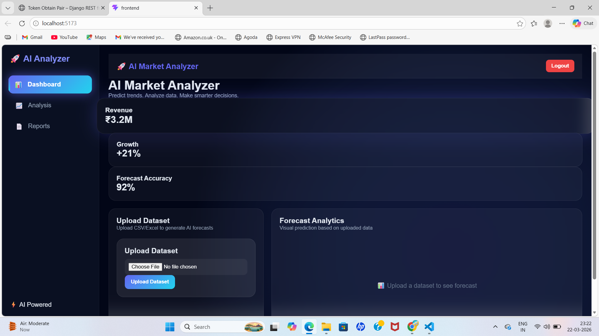
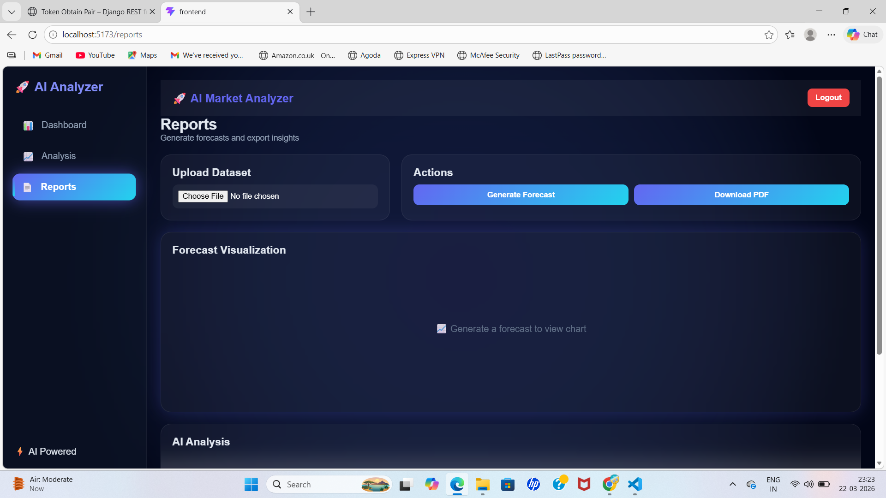

#  AI Market Trend Analyzer


##  Overview

AI Market Trend Analyzer is a full-stack AI-powered analytics platform that allows users to upload datasets, analyze trends, and predict future values using machine learning.

It supports both **sales data** and **stock market datasets**, making it a versatile business intelligence tool.

---

##  Features

*  Upload CSV/Excel datasets
*  Automated data analysis
*  AI-based forecasting using Prophet
*  Interactive charts and dashboards
*  PDF report generation
*  JWT Authentication (secure login)
*  Auto token refresh

---

##  How It Works

1. User logs in securely
2. Uploads dataset
3. Backend processes data using Pandas
4. Prophet model predicts future trends
5. Results displayed with charts
6. Report can be downloaded as PDF

---

##  Screenshots

###  Dashboard



###  Forecast Chart


###  Reports Page



---

##  Tech Stack

### 🔹 Frontend

* React (Vite)
* Axios
* Recharts

### 🔹 Backend

* Django
* Django REST Framework
* Prophet (AI Model)
* Pandas / NumPy

### 🔹 Others

* ReportLab (PDF generation)

---

## ⚙️ Installation

### 1️⃣ Clone Repository

```bash
git clone https://github.com/your-username/ai-market-trend-analyzer.git
cd ai-market-trend-analyzer
```

---

### 2️ Backend Setup

```bash
cd backend
pip install -r requirements.txt
python manage.py runserver
```

---

### 3️ Frontend Setup

```bash
cd frontend
npm install
npm run dev
```

---

##  API Endpoints

| Endpoint                | Method | Description       |
| ----------------------- | ------ | ----------------- |
| `/api/login/`           | POST   | User login        |
| `/api/upload/`          | POST   | Upload dataset    |
| `/api/forecast/`        | POST   | Generate forecast |
| `/api/analyze/`         | POST   | Data analysis     |
| `/api/generate-report/` | POST   | Download report   |

---

##  Future Improvements

*  Candlestick charts (stock view)
*  Technical indicators (RSI, MA)
*  Cloud deployment (AWS / Render)
*  User profiles

---

##  Author

**SHIVPRASAD BEMBULGE**

